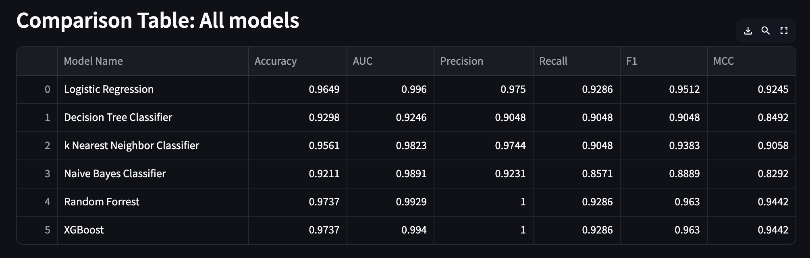

# Wisconsin Breast Cancer Prediction (BITS ML Assignment 2 - 2025AA05653)
The binary classification task of identifying the tumour in the Winsconsin Breast Cancer dataset has been choosen for this assignment.

## Problem Statement
The app has been developed to predict whether a tumour is **malignant(1)** or **benign(0)** in the Wisconsin Breast Cancer Dataset (downloaded from Kaggle). The dataset contains features which are computed from a digitized image of a fine needle aspirate (FNA) of a breast mass.

## Dataset Description
The features describe the characteristics of the cell nuclei present in the image. Some of the features are radius, texture, perimeter, texture, area, smoothnesss, symmetry, fractal dimension etc.  

**Total No.of Features= 30**  

**Total No.of Instances= 569**

### Models Used
The following models are used:  

1. Logistic regression 

2. Decision Tree Classifier  

3. K-Nearest Neighbor Classifier  

4. Naive Bayes Classifier- Gaussian  

5. Random Forest Classifier  

6. XGBoost Classifier  

#### Metrics  

*Primary Metric:* 

The **RECALL** is the primary metric for this type of dataset as misclassifying a malignant tumaor as benign is more crtical for diagnostic purposes.
Alongside, **recall**, the following metrics are also used:  

1. Accuracy  

2. AUC Score  

3. Precision  

4. F1 Score  

5. Matthews Correlation Coefficient (MCC Score)  

##### Comparison of Metrics

###### Observations on performance of each mode

| ML Model Name                    |     Observations about performance   |
|-----------------------------------|----------------------------------------|
| Logistic Regression              | This model has high recall (primary metric) which is important in the medical dignostic cases. Further, the AUC score is the highest which indicates near perfect separability. It is a perfect baseline model for comparison.                                      |
| Decision Tree Classifier        | The AUC is least compared to other models but recall is better than Naive Bayes Classifier. It is simpler but prone to overfitting.                                  |
| K-Nearest Neighbor Classifier | The AUC score is better than decision trees but lesser recall compared to Logistic Regression model.|
| Naive Bayes Classifier (Gaussian) | The recall is least for this model and hence, it is unsuitable for medical diagnostic problems which require higher recall.                                    |
| Random Forest Classifier  | The recall is same as for Logistic Regression with comparable AUC. The precision is perfect which means no false positives. Overall balance is better than Logistic Regression.                                              |
| XGBoost Classifier  | This model is similar to random forest model with slghtly higher AUC. Hence, this model and random forest are equally suitable. Since, this model is more complex, random forest may be preferred over this.        
                                    

Overall, the best models are:  

1. Random Forest (Less Complex-High performance)  

2. XGBoost (More Complex-High Performance)  

3. Logistic Regression (Less Complex-Moderate Performance- More interpretabe)  

4. KNN (Lower performance than above three)  

5. Decision Trees (Lower Performance than top three and lower AUC than KNN)  

6. Naive Bayes (Worst Performance)  